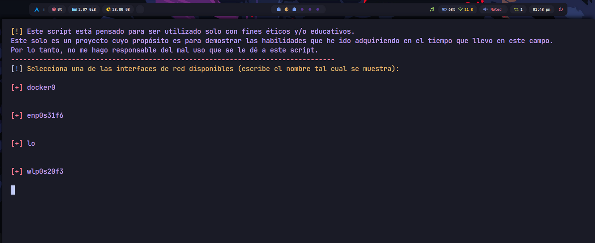

# ghostNet

<p align="center">

</p>

Herramienta para probar la seguridad de una red *Wi-Fi*

## Descripción

ghostNet es un programa diseñado para probar la seguridad de una red Wi-Fi realizando ataques de desautenticación. Este proyecto fue creado con el fin de poner a prueba los conocimientos que he adquirido en el tiempo que llevo estudiando Bash.

## Paquetes necesarios:

sudo apt-get install aircrack-ng wireless-tools # Para distribuciones basadas en Debian

sudo pacman -S aircrack-ng wireless-tools       # Para Arch Linux

## Ejecución del script

Se deben otorgar permisos de ejecución al script para poder ejecutarlo (valga la redundancia)

```chmod +x ghostNet.sh``` o tambíen puedes hacer uso de: ```chmod 744 ghostNet.sh```

Posteriormente, ejecutas el script.

```./ghostNet.sh```

## Como funciona?

*Antes que nada, verifica que tienes instalados los paquetes necesarios.*

Al ejecutar el script, se le pedirá al usuario que elija una interfaz de red por la cual operar.

<p align="center">

</p>

Posteriormente, la interfaz de red seleccionada se pondrá en modo monitor.

<p align="center">

</p>

Ahora, se mostrarán todas las redes Wi-Fi disponibles, junto con sus respectivos BSSID, canales y ESSID.

<p align="center">

</p>

Una vez que el usuario vea las redes Wi-Fi, este seleccionará la red objetivo a través de su BSSID y canal.

<p align="center">

</p>

Finalmente, el usuario puede elegir entre si desautenticar un solo dispositivo, o todos los que se encuentren conectados a esa red.

Para salir, es nada más que el usuario presiona la combinación de teclas *Ctrl* + *C*, el programa se encarga de regresar la interfaz de red del modo monitor, al normal.

## Nota importante

Este script está pensado para ser utilizado solo con fines éticos y/o educativos. Este solo es un proyecto cuyo propósito es demostrar las habilidades que he ido adquiriendo en el tiempo que llevo en este campo. Por lo tanto, no me hago responsable del mal uso que se le dé a este script. Recuerda, nunca pares de hackear! (ético siempre)
